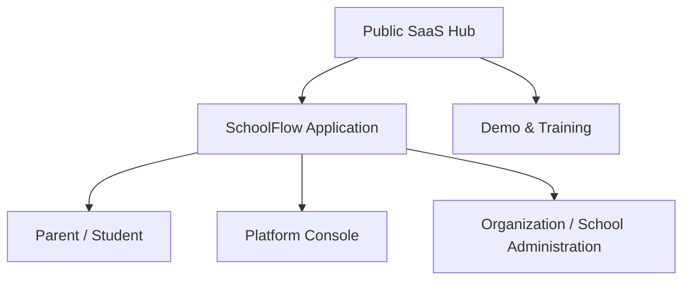

# PX0 route and experience map

This is an information-architecture target, not an implementation or routing
commitment. Missing target routes must not be created before their authorized PX
phase. Every authenticated destination remains server-authorized.

## 1. Experience layers

The layers share one product and authentication foundation, but use different
shell priorities. Platform authority does not derive from organization
ownership. Family access derives from self/relationship authorization rather
than staff permissions.

## 2. Public SaaS Hub

| Target hierarchy                | Current route/state                                                    | PX action                                                                                   |
| ------------------------------- | ---------------------------------------------------------------------- | ------------------------------------------------------------------------------------------- |
| Home                            | `/` operational landing page                                           | Pack A replacement presentation                                                             |
| Product / Solutions             | Missing                                                                | Pack A new public routes                                                                    |
| Modules                         | Missing                                                                | Pack A new public routes/data presentation                                                  |
| Plans                           | Missing                                                                | Pack A presentation over platform catalog; commercial names/prices require founder decision |
| Demo                            | Missing                                                                | Pack A entry; interactive environment delivered in PX7                                      |
| Security / Trust                | Health and terse security claims only                                  | Pack A content surface                                                                      |
| Resources / Support             | Missing                                                                | Post-pilot unless required for launch support                                               |
| Signup / Onboarding             | `/sign-up`, `/onboarding`                                              | Restyle/refactor, preserve secure mutations                                                 |
| Sign in / Recovery / Invitation | `/login`, `/forgot-password`, `/update-password`, `/accept-invitation` | Unified authentication family                                                               |

Target public flow:

`Home → Product/Solutions → Modules → Plans → Demo → Signup/Onboarding`

Authentication remains directly reachable throughout.

## 3. Authenticated SchoolFlow

| Target group   | Target destinations                                                                                                                    | Current mapping                                               | Notes                                                                   |
| -------------- | -------------------------------------------------------------------------------------------------------------------------------------- | ------------------------------------------------------------- | ----------------------------------------------------------------------- |
| Home           | Personalized Home, My Day, recent work, exceptions                                                                                     | `/dashboard` module directory                                 | Home and My Day should be distinct patterns even if initially one route |
| My Day         | classes, attendance, scores, approvals, finance and management tasks                                                                   | Distributed across module pages                               | New composed read experience; no new business authority                 |
| Action Center  | tasks, approvals, notifications, exceptions                                                                                            | `/action-center`                                              | Retain foundations; replace composition                                 |
| People         | Students, Student 360, Staff, Staff 360, guardians                                                                                     | `/students`, `/staff`, details                                | Standard register/360 patterns                                          |
| Academics      | Academic Setup, Teaching, Attendance, Assessment/Results                                                                               | `/academic-setup`, `/teaching`, `/attendance`, `/assessments` | Role-prioritized subnavigation                                          |
| Operations     | Admissions, Finance, Documents and approved operational tools                                                                          | `/admissions`, `/finance`, `/documents`                       | Exact placement can be validated in prototypes                          |
| Communication  | Notices, messaging, notifications/preferences                                                                                          | `/communication`                                              | Preserve M11 privacy boundaries                                         |
| Insights       | Management dashboards, reports, search/export/print                                                                                    | `/management`                                                 | Search may also become a global shell entry                             |
| Administration | Organization, schools, locations, users, invitations, memberships, roles, effective access, groups, modules, branding, settings, audit | `/administration`, `/audit`; most mutation UI missing         | Build ordinary tenant admin separately from Platform Console            |
| Account        | profile, session, preferences, help, sign out                                                                                          | email + sign-out only in header                               | New profile menu; no auth weakening                                     |

## 4. Context hierarchy

The shell should continuously expose:

`Organization → School or organization-wide scope → Academic session → Term/period`

Current organization/school context is a server-validated cookie selection on
`/dashboard`. Session/period is usually page/query/service context. PX1 should
design a Context Ribbon and context-switch contract; it must not broaden access
or silently reinterpret a page's required academic context.

## 5. Families

### Parent

- Home
- For You
- Children / child switcher / All Children
- Attendance
- Fees & Payments
- Results / report cards
- Announcements
- Messages
- Documents
- Profile/preferences

### Student

- Home / today
- Attendance
- Published results
- Announcements
- Messages
- Profile
- Future learning activities only when separately approved

Current `/portal` combines a learner switcher, summary, published-result count
and notices. Draft/internal assessment information, unrelated Finance data and
unrelated learners remain inaccessible. The target is a consumer-style shell,
not a duplicate of the staff application.

## 6. Platform

| Target group        | Destinations                                                                    | Current state                                                    |
| ------------------- | ------------------------------------------------------------------------------- | ---------------------------------------------------------------- |
| Platform Home       | service/tenant status and operator work                                         | Missing; `/api/health` is a safe machine endpoint only           |
| Organizations       | tenant directory and creation/status                                            | Backend tenancy exists; no console                               |
| Tenant 360          | overview, schools, subscription, modules, features, branding, operations, audit | Missing                                                          |
| Plans & Modules     | catalog and packaging                                                           | Backend catalogs exist; ordinary authenticated writes denied     |
| Entitlements        | organization/module state                                                       | Backend model/RPC behavior exists; no console                    |
| Feature Rollout     | defaults and scoped overrides                                                   | Backend model exists; operator-assisted only                     |
| Platform Operations | health, support diagnostics, announcements, audits                              | Partial external operational tools and audit data; no unified UI |
| Platform Operators  | explicit operator assignments/capabilities                                      | Future authorization design required                             |

Target hierarchy:

`Platform Console → Organizations → Tenant 360 → Plans/Modules → Entitlements → Feature Rollout → Platform Operations`

## 7. Canonical target URL proposal for prototypes

These are naming proposals for prototype planning, not routes authorized in PX0.

| Layer             | Proposed namespace                                                                       |
| ----------------- | ---------------------------------------------------------------------------------------- |
| Public product    | `/product`, `/modules`, `/solutions`, `/plans`, `/demo`, `/security`                     |
| Staff application | existing semantic roots retained where practical; `/home` and `/my-day` evaluated in PX1 |
| Parent/student    | `/portal/parent/*`, `/portal/student/*`, with safe transition from `/portal`             |
| Administration    | `/administration/*`                                                                      |
| Platform          | `/platform/*` with distinct server guard                                                 |
| Demo              | `/demo/*` backed only by isolated synthetic tenant/context                               |

## 8. Navigation rules

1. Navigation is computed from effective authorization, entitlement, feature
   availability, relationship and active context; it is never the security
   boundary.
2. Permission-denied destinations should generally not leak to the user.
3. Authorized but unavailable destinations may appear with a specific
   explanation and safe remediation path.
4. Deep links independently reauthorize.
5. A platform route requires platform authority; organization ownership is
   insufficient.
6. Parent/student destinations use relationship/self guards and published/read
   models, not staff-module access.
7. Mobile navigation is purpose-built, not a squeezed desktop sidebar.
8. Module subnavigation must reduce long-page overload without obscuring
   workflow state.

## 9. Route migration guardrails

- Prefer compatible route retention during presentation migration.
- Introduce redirects only with tests and documented rollback.
- Do not maintain two complete operational UIs indefinitely.
- Do not move server authorization into client navigation.
- Do not expose platform, audit, private-document, Finance or assessment state
  through public/demo routes.
- Build representative prototypes before broad route migration.
